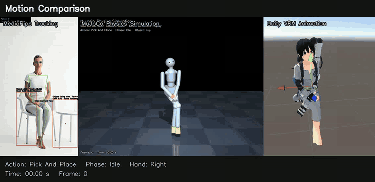
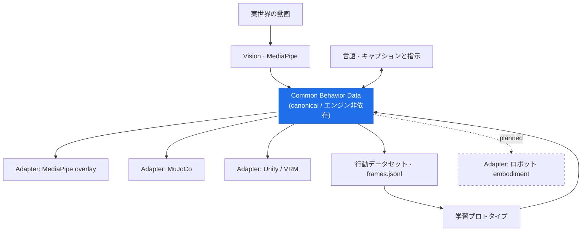
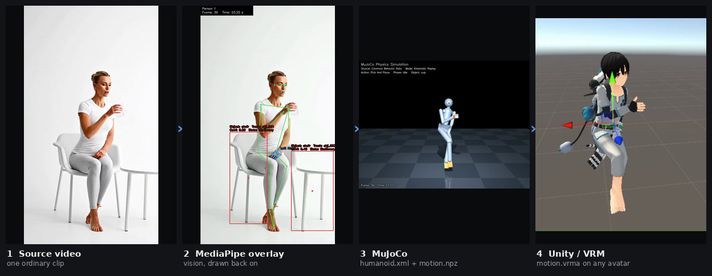
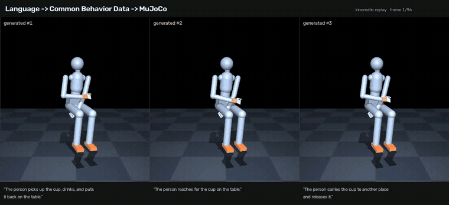

<div align="center">

# Common Behavior Data

**Behavior should be portable.**

本リポジトリでは、ロボティクス・シミュレーション・AI・モーション用途をつなぐことを目指す、
オープンな行動表現（behavior representation）の設計を目指します。

[](docs/limitations.md)
[](LICENSE)
[](#現時点で動いているもの)

[](docs/media/technical-concept-deck.pdf)

*コンセプト・アーキテクチャ・デモ・ロードマップを 1 枚にまとめたビジュアル資料です。*

[English README](README.md) ·
[コンセプト](docs/concept.md) ·
[アーキテクチャ](docs/architecture.md) ·
[仕様](specification/README.md) ·
[ロードマップ](docs/roadmap.md) ·
[制限事項](docs/limitations.md)



*1本の動画 → 1つの行動データ → 同一タイムライン上の3つの異なるレンダラ（媒体）*

</div>

---

## Common Behavior Data について

人の行動を模した行動データは、たいていは閉じたツールの中にあります。例えば、モーションキャプチャの
フォーマット、ゲームエンジンのアニメーション、シミュレータの関節配列、特定のロボット
アームの関節次元にエンコードされた学習データセット、ランドマーク列、モデルの出力ヘッドの形などです。

行動データは用途に合わせて個別最適化されているケースが多いです。しかしながら、行動データの価値を最大化してデジタルの恩恵をPhysical（物理）世界へ展開していくことを想定すると、「人がカップを持ち上げる」という
単一の行動が互いに非互換な形で多く存在することになり、用途が変わるたびにデータを変換することが必要です。

ロボティクスや Physical AI では、データの非標準は大きな障壁となります。*同じ* 行動
（reach / grasp / carry / place）が、表現の違い・エンジンの違い、そして最終的には
**身体（embodiment）の違い** を越えて残らなければならないからです。

**Common Behavior Data（CBD）** は、その中間に再利用可能な層を1枚置く試みです。

```text
実世界の動画  →  Common Behavior Data  →  言語と整合した学習
                        ↓                          ↓
                 MuJoCo / Unity  ←  生成された行動
```

> **実世界の動画から再利用可能な行動データへ。そして言語からモーションへ。**

## CBD とは何か

CBD は **行動表現（behavior representation）** と位置づけます。データセットではなく、
標準規格でもありません。

共通タイムライン上に、以下を保持することを目指しています。

姿勢 · 手 · 顔と表情 · ジェスチャー · ボーン回転 · 関節角 ·
物体検出とトラック · インタラクション候補 · 行動フェーズ ·
時系列キャプション · モーション指標 · 品質と来歴（provenance）のメタデータ

このタイムラインは、同じコンセプトを維持しながら、価値を拡張していけるものにしたいと考えています。
物理的なインタラクションはキネマティクス（映像からの読み取りによる）だけでは記述しきれないため、
接触や衝撃、把持力や印加力、トルク、触覚・IMU の系列、素材や強度の特性といったセンサー側の
データも、同じ表現に載せられないかを今後検討していきます。詳しくは
[ロードマップ](#ロードマップ)に記載をしました。

**ステータス: 実験段階。** スキーマの設計を机上で先に仕上げるのではなく、実際のアダプタを
コーディングで構築しながら育てています。現時点で、確立された標準、特定のサービスで採用されているということではなく、
開発段階です。現時点で存在するもの／未解決のものについては
[`specification/`](specification/README.md) をご覧ください。

## 現時点で動いているもの

Colab で動く2つのエンドツーエンドデモが、同じ表現をはさんで両側に配置されています。

| | Demo A — Human Capture | Demo B — Language to Motion |
|---|---|---|
| 方向 | 観測 → 行動データ | 行動データ → 学習 → 生成 |
| 入力 | 人物動画1本 | Demo A の出力バンドル |
| 出力 | `frames.jsonl` + CSV群 + `motion.vrma` + `humanoid.xml`/`motion.npz` | 同じファイル一式を、1文から生成 |
| 状態 | 動作する | 動作する小規模プロトタイプ |
| ノートブック | [`examples/human-capture`](examples/human-capture/) | [`examples/language-to-motion`](examples/language-to-motion/) |

撮影動画を各モーションデータに変換するデモA、VLA学習を通じて言語指示から学習した行動の再現を目指すデモB、
双方が中間層にある**Common Behavior Data**によって繋がっています。

## 1つの行動層、複数の出力



設計上の選択はこうです。

```text
こうではなく:             CBD はこうする:
  Language → Unity            Language
  Language → MuJoCo              ↓
  Language → Robot            Behavior
                                 ↓
                            embodiment / エンジン固有の Adapter
```

5つ目の出力先を増やすときに書くのは、もう1本のパイプラインではなく、1つのアダプタ
だけで済むはずだ——この仮説を実証していきます。詳しくは
[`docs/architecture.md`](docs/architecture.md)参照。

---

## Demo A — 動画 → CBD

**1本の動画が、複数の表現形式で再利用できる行動データになる。**



MediaPipe と MuJoCo / Unity を**直接つなぎません**。Vision は CBD へ書き込み、
各レンダラは CBD から読み出します。

- オーバーレイ動画は、CBD を元映像のピクセル上に描き戻したもの
- MuJoCo へは `humanoid.xml`（モデル）と `motion.npz`（モーション）を意図的に分離して出力
- Unity へは `motion.vrma`。VRM 1.0 アバターであれば再生可能。
  Unity はここでは再生・可視化に使っており、推論エンジンとしては使っていません
- その他すべては `04_behavior_dataset/`（マスターデータ）に格納

[](https://colab.research.google.com/github/Koichi3333/common-behavior-data/blob/main/examples/human-capture/human_behavior_demo_2_0.ipynb)

→ **[実行方法と詳細](examples/human-capture/README.md)** ·
[サンプル出力](examples/human-capture/sample_output/)

## Demo B — 言語 → CBD

**Demo A で取得した行動が学習データになり、生成された行動が同じアダプタで戻ってくる。**



*3つの英語での指示から生成されたそれぞれの行動を、Demo A の MuJoCo アダプタで再生したもの。
下流のどのコンポーネントも、これが生成物であることを知りません。*

Demo A の出力は、追加の加工なしにそのまま学習に使えるデータセットになっています。
**`frames.jsonl` の1行が、それだけで完結した教師ありサンプルになっている**からです。
入力として与える側（コマ画像とキャプション）と、予測させたい側（ボーン回転・hips・
指カール・phase）が、同じタイムラインの同じ時刻に、ひとつのレコードとして並んで
書き込まれています。

モーションデータと映像、キャプションの紐づけをコードと生成AIで実現しました。人手でラベルを付ける必要がなく、
動画とアノテーションファイルを突き合わせる必要もなく、モーション系列とテキスト系列の
タイムスタンプを合わせ直す必要もありません。この対応付けは前処理スクリプトが作り出す
ものではなく、フォーマットそのものが持っている性質だからです。`frames.jsonl` は1行ずつ
読んで、そのままモデルに渡せます。視覚と言語で条件付けした小さな causal Transformer が
これを直接学習し、`frames.jsonl` / `motion.vrma` / `humanoid.xml` / `motion.npz` /
`replay_mujoco.py` を出力します。

> ⚠️ **これは汎用 VLA ではありません。** 現在の規模でできているのは、記憶と補間、
> そして言語で条件付けした行動生成を示すところまでで、**小規模な VLA ライクの学習
> プロトタイプ**にとどまります。未知の指示への汎化にはまだ対応していません。

[](https://colab.research.google.com/github/Koichi3333/common-behavior-data/blob/main/examples/language-to-motion/human_behavior_vla_trainer.ipynb)

→ **[実行方法と詳細](examples/language-to-motion/README.md)** ·
[サンプル出力](examples/language-to-motion/sample_output/)

---

## データ表現

このアイデアを体現しているのが `timeline/frames.jsonl` です。
**1行 = 1コマ、そして1コマが完全なタプル**になっています。

```jsonc
{
  "frame": 42,
  "timestamp_sec": 3.5,
  "frame_image": "timeline/frames/000042.jpg",     // 視覚
  "caption": { "en": "The person reaches for the cup", "source": "gemini_api" },  // 言語
  "human": {
    "bone_rotations_xyzw": { "left_upper_arm": [x, y, z, w], "...": [] },        // 行動
    "hips_position": [x, y, z],
    "finger_curls_rad": { "left": [...], "right": [...] },
    "joint_angles_deg": {}, "face_blendshapes": {}, "gestures": {}
  },
  "objects": [ { "track_id": "obj_005", "label": "cup", "role": "target",
                 "position_source": "estimated_from_hand" } ],                    // 物体
  "interactions": [ { "type": "grasp_candidate", "score": 0.8 } ],                // 候補
  "phase": { "action": "Pick And Place", "phase": "Grasp", "hand": "Right" }      // 状態
}
```

視覚・言語・行動・物体・状態が、ひとつの行に揃っています。この整合があることで、
同じファイルが「観測の記録」であると同時に「学習サンプル」にもなります。モデルに与える
入力と、モデルに予測させたい出力が、すでに同じ1行の中に並んでいる。つまり**コマ単位で
教師信号が完結している**ので、キャプチャから学習までのあいだにアノテーション工程が
入りません。何を予測させたいか（ボーン回転、phase ラベル、キャプション）を変えても、
その教師信号はすでに揃っています。変わるのは、どのフィールドを入力にして、どれを
正解にするかという選び方だけです。

同じデータは列指向の CSV（`human/`, `objects/`, `interactions/`, `metrics/`）にも
展開してあり、分析用途や、一部の系列だけあれば足りるアダプタはこちらを使えます。
詳しくは [`specification/README.md`](specification/README.md)を参照ください。

特に明示しておきたい3つの約束事（いずれもデータの読み方に関わります）:

- **`interaction_events` は候補（candidate）である。** heuristic であり Ground Truth
  ではありません。列名にもそう書いてあります。
- **導出された3D位置には必ず `position_source` が付く**（`detected_2d`,
  `estimated_from_hand`, `last_known_position`, `fixed_depth_proxy` など）。
  実測ではなく推定した深度は、必ずそれと分かる形で記録します。
- **キャプションは AI 生成の説明文**であり、生成モデル名とともに記録されます。

## アダプタの状況

| アダプタ / 接続 | ステータス | 現在の根拠 |
|---|---|---|
| Video → CBD | **Available** | Demo A, [`examples/human-capture`](examples/human-capture/) |
| CBD → MuJoCo humanoid | **Available** | Kinematic replay（`qpos` + `mj_forward`） |
| CBD → Unity / VRM | **Available** | VRMA 出力、UniVRM SimpleVrma で再生 |
| CBD → 行動データセット | **Available** | `frames.jsonl` + CSV群 |
| Language → CBD | **Experimental** | Demo B、小規模学習プロトタイプ |
| CBD → ロボット embodiment（例: SO-101） | Planned | 再身体化の実験。対象プラットフォームは未確定 |
| CBD ↔ LeRobot | Planned | 統合 / コントリビュータ対象 |
| CBD → Isaac | Planned | 統合対象 |
| CBD → ROS 2 | Planned | 統合対象 |

*Planned* のものは、このリポジトリにまだコードとして存在しません
（[`docs/roadmap.md`](docs/roadmap.md)）。

## デモを試す

どちらのノートブックも Colab で動かす前提なので、ローカルの環境構築は不要です。

1. [`examples/human-capture/human_behavior_demo_2_0.ipynb`](examples/human-capture/human_behavior_demo_2_0.ipynb) を Colab で開く
2. `ランタイム → ランタイムのタイプを変更 → T4 GPU`（CPU でも完走します。遅いだけです）
3. 上から順に実行します。セル `[2]` で 10〜30秒の人物動画（何かを持ち上げる動作）を指定
4. *(任意)* Colab シークレットに `GEMINI_API_KEY` を登録すると時系列キャプションが生成されます
5. `demo2_output_bundle.zip` をダウンロード
6. [`examples/language-to-motion/human_behavior_vla_trainer.ipynb`](examples/language-to-motion/human_behavior_vla_trainer.ipynb)
   を開き、バンドルを投入して学習 → 自分の文章から行動を生成

コアのパイプラインに API キーは記載しません。認証情報は Colab Secrets か環境変数からのみ
読み込み、ノートブックに書き込むことはありません。

動かす前に中身を見たい場合は、どちらのデモも実際の出力を同梱しています——
[`human-capture/sample_output/`](examples/human-capture/sample_output/) と
[`language-to-motion/sample_output/`](examples/language-to-motion/sample_output/) です。

## 公開について

データセット規模・モデルサイズ・専用ハードウェア・垂直統合されたロボットスタックよりも、
データの特性や汎用性にfocusして価値を見出すことに、より重きを置いています。

**中立性・相互運用性・オープンな仕様・再利用可能な
行動セマンティクス・アダプタによる統合**——使いやすいデータ様式を追求しながら、
ネットワークが広がり、行動データの裾野を広げ、価値の創出面積が広がっていくことを目指します。


```text
コアが行動表現を維持する
        ↓
コントリビュータがアダプタとツールを追加する
        ↓
互換なシステムが増える
        ↓
ユーザーが増える → コントリビュータとパートナーが増える
```

これはあくまで**設計目標**として書いています。詳しくは
[`docs/ecosystem.md`](docs/ecosystem.md)を参照ください。

## ロードマップ

次なるマイルストーンとして、人のキャプチャを増やすことだけではなく、
**データの抽象化が様々なロボット様式やVRに適用しきれるか** の実装を広げていきます。

```text
人の動画 → CBD → 行動意図 / エンドエフェクタ表現
              → ロボット Adapter → シミュレータ上のロボット → タスク成功
```

人の関節角をロボットアームにコピーするだけでなく、
reach / grasp / lift / carry / place / release といった**行動意図**が、別の身体でも
再現できるのかを確かめていきます。

SO-101 のような低コストなアームなどコストハードルの低い実機での再現が有力な打ち手ですが、
異なる物理シミュレーションでの検証を優先することも検討しています。

もうひとつ検討していくのが、**CBD に追加していくデータの拡張性**です。いまのタイムラインに
あるのは視覚・言語・キネマティクスですが、物理世界の行動には力が関わります。接触や
衝撃、把持力や印加力、トルクや荷重、触覚・IMU の読み値、対象物の素材や強度といった
ものです。これらを同じタイムライン上の一級のチャンネルとして持つのか、タイムスタンプで
参照する別レイヤーに分けるのかは、まだ決まっていません。詳しくは
[`docs/roadmap.md`](docs/roadmap.md)を参照ください。

## 制限事項

要約:

- 単一人物前提。深度は単眼推定
- インタラクション判定は heuristic な **候補** であり Ground Truth ではない
- MuJoCo 再生は **Kinematic Replay** であり、物理的に正しい接触ではない
- 学習プロトタイプは記憶・補間であり、汎化しない
- sim-to-real なし、ロボットのタスク成功なし、把持の正しさの主張なし
- 指の角度は手ランドマークのカールからの近似
- スキーマは不安定であり、今後変わる

理由つきの完全な一覧: [`docs/limitations.md`](docs/limitations.md)。

## コントリビュート

これは初期段階の、個人による独立したオープンソース実験です。
——ロボット / シミュレータのアダプタ、ROS 2、Isaac、Blender / Unreal エクスポータ、
IK・リターゲティング、可視化、評価ツール、VLM 統合、リファレンスアプリケーション——

まずは [`CONTRIBUTING.md`](CONTRIBUTING.md) をご覧ください。大きな設計変更の前には
Issue か Discussion を開いてもらえると助かります。スキーマはまだ固まっておらず、
変えるとしても**抽象論ではなく実際の統合がきっかけであるべき**だと考えています。

## CBD を使っていますか？

**何を作っているか教えてください。** つなぎたいロボット・シミュレータ・モデル・
アプリケーションがあれば是非教えてください。
[Discussion](https://github.com/Koichi3333/common-behavior-data/discussions) か [Issue](https://github.com/Koichi3333/common-behavior-data/issues) を開いてください。

利用に際してフィードバックをいただけますと、大変助かります。

## CBDを作る理由

ロボティクス・シミュレーション・モーション・AI の各分野は急速に進歩していますが、
行動データは今も特定のツールや embodiment に紐づいたままであることが多いと感じています。
小さくオープンで再利用可能な行動データがあることで、実験どうしをつなぎやすく、広げやすく
なるのではないかと考えています。すでにE2Eで動く2つのデモを起点に、試行を繰り返していきます。

## ライセンスと第三者素材

このリポジトリのオリジナルのソースコードとドキュメントは、特記なき限り
**Apache-2.0**（[`LICENSE`](LICENSE)）です。

データセット・モデル重み・デモ用メディア・元動画・VRM アセット・第三者素材については、
別の条件が付く場合があります（`examples/*/sample_output/` のサンプル出力を含む）。
再配布の前に [`THIRD_PARTY_NOTICES.md`](THIRD_PARTY_NOTICES.md) をご確認ください。
