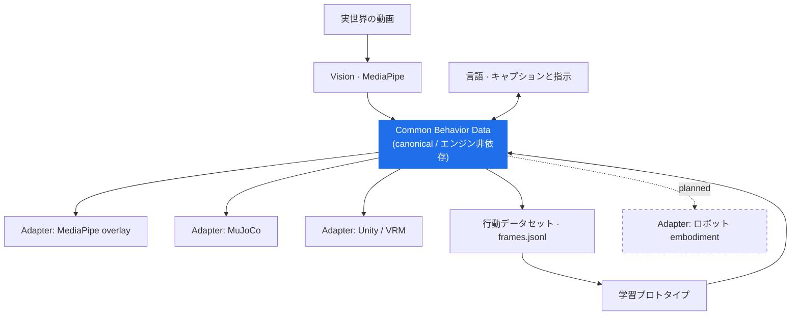

<div align="center">

# Common Behavior Data

**行動データは、ツールをまたいで再利用できるべきだ。**

ロボティクス・シミュレーション・AI・モーション用途をつなぐことを目指す、
実験的なオープン行動表現（behavior representation）です。

[](docs/limitations.md)
[](LICENSE)
[](#現時点で動いているもの)

[English README](README.md) ·
[コンセプト](docs/concept.md) ·
[アーキテクチャ](docs/architecture.md) ·
[仕様](specification/README.md) ·
[ロードマップ](docs/roadmap.md) ·
[制限事項](docs/limitations.md)


*1本の動画 → 1つの行動データ → 3つの異なるレンダラ、同一タイムライン。*

</div>

---

## なぜ Common Behavior Data か

人の行動データは、たいてい「何かの内側」で生まれます。モーションキャプチャの
フォーマット、ゲームエンジンのアニメーション、シミュレータの関節配列、特定の
ロボット腕の次元でエンコードされた学習データセット、意味情報のないランドマーク列、
モデルの出力ヘッドの形。

個々には妥当です。しかし全体としては、「人がカップを持ち上げる」という同一の行動が
互いに非互換な6つの形で存在し、任意の2つをつなぐたびに個別の統合作業が発生します。

ロボティクスや Physical AI では、この問題はさらに重くなります。*同じ* 行動
（reach / grasp / carry / place）が、表現の違い・エンジンの違い、そして最終的には
**身体（embodiment）の違い** を越えて生き延びなければならないからです。

**Common Behavior Data（CBD）** は、その中間に再利用可能な層を1枚置く実験です。

```text
実世界の動画  →  Common Behavior Data  →  言語と整合した学習
                        ↓                          ↓
                 MuJoCo / Unity  ←  生成された行動
```

> **実世界の動画から再利用可能な行動データへ。そして言語からモーションへ。**

## CBD とは何か

CBD は **行動表現（behavior representation）** です。データセットではなく、
標準規格でもありません。

共通タイムライン上に、以下を保持することを目指しています。

姿勢 · 手 · 顔と表情 · ジェスチャー · ボーン回転 · 関節角 ·
物体検出とトラック · インタラクション候補 · 行動フェーズ ·
時系列キャプション · モーション指標 · 品質とprovenanceメタデータ

**ステータス: 実験段階。** スキーマは事前に設計するのではなく、実際のアダプタ実装に
よって進化させています。確立された標準ではなく、業界採用もなく、完成もしていません。
現時点で存在するもの／未解決のものは
[`specification/`](specification/README.md) を参照してください。

## 現時点で動いているもの

Colab で動く2つのエンドツーエンドデモが、同じ表現をはさんで両側に配置されています。

| | Demo A — Human Capture | Demo B — Language to Motion |
|---|---|---|
| 方向 | 観測 → 行動データ | 行動データ → 学習 → 生成 |
| 入力 | 人物動画1本 | Demo A の出力バンドル |
| 出力 | `frames.jsonl` + CSV群 + `motion.vrma` + `humanoid.xml`/`motion.npz` | 同じファイル一式を、1文から生成 |
| 状態 | 動作する | 動作する小規模プロトタイプ |
| ノートブック | [`examples/human-capture`](examples/human-capture/) | [`examples/language-to-motion`](examples/language-to-motion/) |

重要なのは個々のデモではなく、**両者が中央で出会う**ことです。観測されたモーションを
記述する表現が、そのままモデルの学習対象であり、モデルが生成して戻ってくる先でもあります。

## 1つの行動層、複数の出力



この設計を成り立たせている原則:

```text
作らない:                   こうする:
  Language → Unity            Language
  Language → MuJoCo              ↓
  Language → Robot            Behavior
                                 ↓
                            embodiment / エンジン固有の Adapter
```

5番目の消費者を追加するとき、書くべきは「もう1本のパイプライン」ではなく
「1つのアダプタ」であるべきです。詳細は
[`docs/architecture.md`](docs/architecture.md)。

---

## Demo A — 動画 → CBD

**1本の動画が、複数の representation で再利用できる行動データになる。**


MediaPipe と MuJoCo / Unity を**直接つなぎません**。Vision は CBD へ書き込み、
各レンダラは CBD から読み出します。

- オーバーレイ動画は、CBD を元映像のピクセル上に描き戻したもの
- MuJoCo へは `humanoid.xml`（モデル）と `motion.npz`（モーション）を意図的に分離して出力
- Unity へは `motion.vrma`。VRM 1.0 アバターであれば再生可能。
  **Unity はここでは再生・可視化であり、推論エンジンではありません**
- その他すべては `04_behavior_dataset/`（マスターデータ）に格納

[](https://colab.research.google.com/github/Koichi3333/common-behavior-data/blob/main/examples/human-capture/human_behavior_demo_2_0.ipynb)

→ **[実行方法と詳細](examples/human-capture/README.md)** ·
[サンプル出力](examples/human-capture/sample_output/)

## Demo B — 言語 → CBD

**Demo A で取得した行動が学習データになり、生成された行動が同じアダプタで戻ってくる。**


*3つの英語指示から生成された3つの行動を、Demo A の MuJoCo アダプタで再生したもの。
下流のどのコンポーネントも、これが生成物であることを知りません。*

`frames.jsonl` の各行には、素材（コマ画像＋キャプション）と回答（ボーン回転・hips・
指カール・phase）がすでにペアで入っています。同一タイムラインに書き込まれているためです。
したがってアノテーション工程は不要で、視覚・言語条件付きの小さな causal Transformer が
そのまま学習でき、`frames.jsonl` / `motion.vrma` / `humanoid.xml` / `motion.npz` /
`replay_mujoco.py` を出力します。

> ⚠️ **これは汎用 VLA ではありません。** 現在の規模では、記憶・補間と言語条件付き
> 行動生成を示す **小規模な VLA ライク学習プロトタイプ** です。未知の指示には汎化しません。
> この制限は意図的にここに書いています（末尾に隠していません）。

[](https://colab.research.google.com/github/Koichi3333/common-behavior-data/blob/main/examples/language-to-motion/human_behavior_vla_trainer.ipynb)

→ **[実行方法と詳細](examples/language-to-motion/README.md)** ·
[サンプル出力](examples/language-to-motion/sample_output/)

---

## データ表現

このアイデアを体現しているのが `timeline/frames.jsonl` です。
**1行 = 1コマ、そして1コマが完全なタプル**になっています。

```jsonc
{
  "frame": 42,
  "timestamp_sec": 3.5,
  "frame_image": "timeline/frames/000042.jpg",     // 視覚
  "caption": { "en": "The person reaches for the cup", "source": "gemini_api" },  // 言語
  "human": {
    "bone_rotations_xyzw": { "left_upper_arm": [x, y, z, w], "...": [] },        // 行動
    "hips_position": [x, y, z],
    "finger_curls_rad": { "left": [...], "right": [...] },
    "joint_angles_deg": {}, "face_blendshapes": {}, "gestures": {}
  },
  "objects": [ { "track_id": "obj_005", "label": "cup", "role": "target",
                 "position_source": "estimated_from_hand" } ],                    // 物体
  "interactions": [ { "type": "grasp_candidate", "score": 0.8 } ],                // 候補
  "phase": { "action": "Pick And Place", "phase": "Grasp", "hand": "Right" }      // 状態
}
```

視覚 + 言語 + 行動 + 物体 + 状態が揃っている。この整合こそが、同じファイルを
「観測記録」と「学習サンプル」の両方にしています。

同じデータは列指向の CSV（`human/`, `objects/`, `interactions/`, `metrics/`）にも
射影され、分析や単一系列だけを必要とするアダプタが利用します。詳細は
[`specification/README.md`](specification/README.md)。

特に明示しておきたい3つの約束事（いずれも「誠実さ」の問題です）:

- **`interaction_events` は候補（candidate）である。** heuristic であり Ground Truth
  ではありません。列名にもそう書いてあります。
- **導出された3D位置には必ず `position_source` が付く**（`detected_2d`,
  `estimated_from_hand`, `last_known_position`, `fixed_depth_proxy` など）。
  深度を黙って捏造しません。
- **キャプションは AI 生成の説明文**であり、生成モデル名とともに記録されます。

## アダプタの状況

| アダプタ / 接続 | ステータス | 現在の根拠 |
|---|---|---|
| Video → CBD | **Available** | Demo A, [`examples/human-capture`](examples/human-capture/) |
| CBD → MuJoCo humanoid | **Available** | Kinematic replay（`qpos` + `mj_forward`） |
| CBD → Unity / VRM | **Available** | VRMA 出力、UniVRM SimpleVrma で再生 |
| CBD → 行動データセット | **Available** | `frames.jsonl` + CSV群 |
| Language → CBD | **Experimental** | Demo B、小規模学習プロトタイプ |
| CBD → SO-101 / MuJoCo | Planned next | Pick & Place リファレンスデモ |
| CBD ↔ LeRobot | Planned | 統合 / コントリビュータ対象 |
| CBD → Isaac | Planned | 統合対象 |
| CBD → ROS 2 | Planned | 統合対象 |

*Planned* のものは、このリポジトリにコードとして存在しません。空のアダプタ
ディレクトリで実装済みに見せることもしていません（[`docs/roadmap.md`](docs/roadmap.md)）。

## デモを試す

どちらのノートブックも Colab 前提で、ローカル環境構築は不要です。

1. [`examples/human-capture/human_behavior_demo_2_0.ipynb`](examples/human-capture/human_behavior_demo_2_0.ipynb) を Colab で開く
2. `ランタイム → ランタイムのタイプを変更 → T4 GPU`（CPU でも完走します。遅いだけです）
3. 上から順に実行。セル `[2]` で 10〜30秒の人物動画（何かを持ち上げる動作）を指定
4. *(任意)* Colab シークレットに `GEMINI_API_KEY` を登録すると時系列キャプションが生成されます
5. `demo2_output_bundle.zip` をダウンロード
6. [`examples/language-to-motion/human_behavior_vla_trainer.ipynb`](examples/language-to-motion/human_behavior_vla_trainer.ipynb)
   を開き、バンドルを投入して学習 → 自分の文章から行動を生成

コアのパイプラインに API キーは不要です。認証情報は Colab Secrets または環境変数から
のみ読み込まれ、ノートブックに書き込まれることはありません。

実行前に中身を見たい場合、両デモとも実際の出力を同梱しています:
[`human-capture/sample_output/`](examples/human-capture/sample_output/) と
[`language-to-motion/sample_output/`](examples/language-to-motion/sample_output/)。

## なぜオープンにするのか

データセット規模・モデルサイズ・専用ハードウェア・垂直統合されたロボットスタックでは、
大きな組織が優位です。このプロジェクトはそこで競争しません。

検証している仮説は逆側にあります。**中立性・相互運用性・オープンな仕様・再利用可能な
行動セマンティクス・アダプタベースの統合** — 特定の誰のものでもないがゆえに、
誰でも使える層に持続的な価値があるのではないか、という仮説です。

```text
コアが行動表現を維持する
        ↓
コントリビュータがアダプタとツールを追加する
        ↓
互換なシステムが増える
        ↓
ユーザーが増える → コントリビュータとパートナーが増える
```

これは**設計目標**としての記述です。実績（traction）ではありませんし、このリポジトリは
それを装いません。詳細は [`docs/ecosystem.md`](docs/ecosystem.md)。

## ロードマップ

次の本当の問いは、人のキャプチャを増やすことではありません。
**この抽象が embodiment の変更を生き延びるか** です。

**次: SO-101 Pick & Place。**

```text
人の動画 → CBD → 行動意図 / エンドエフェクタ表現
              → SO-101 Adapter → MuJoCo SO-101 → タスク成功
```

目標は、人の関節角をロボット腕にコピーすることでは **ありません**。
reach / grasp / lift / carry / place / release という**行動意図**が、
別の身体で再現できるかを検証することです。詳細は
[`docs/roadmap.md`](docs/roadmap.md)。

## 制限事項

意図的に見える場所に置いています。要約:

- 単一人物前提。深度は単眼推定
- インタラクション判定は heuristic な **候補** であり Ground Truth ではない
- MuJoCo 再生は **Kinematic Replay** であり、物理的に正しい接触ではない
- 学習プロトタイプは記憶・補間であり、汎化しない
- sim-to-real なし、ロボットのタスク成功なし、把持の正しさの主張なし
- 指の角度は手ランドマークのカールからの近似
- スキーマは不安定であり、今後変わる

理由つきの完全な一覧: [`docs/limitations.md`](docs/limitations.md)。

## コントリビュート

これは初期段階の、個人による独立したオープンソース実験です。だからこそ「端」の部分
——ロボット / シミュレータのアダプタ、ROS 2、Isaac、Blender / Unreal エクスポータ、
IK・リターゲティング、可視化、評価ツール、VLM 統合、リファレンスアプリケーション——
への貢献が最も効きます。

まずは [`CONTRIBUTING.md`](CONTRIBUTING.md) をご覧ください。大きな設計変更の前には
Issue か Discussion を開いてください。スキーマはまだ動いており、そして
**抽象論ではなく実際の統合によって動くべき**だと考えています。

## CBD を使っていますか？

**何を作っているか教えてください。** つなぎたいロボット・シミュレータ・モデル・
アプリケーションはありますか？ まだ存在しないアダプタが必要ですか？
[Discussion](https://github.com/Koichi3333/common-behavior-data/discussions) か [Issue](https://github.com/Koichi3333/common-behavior-data/issues) を開いてください。

「このスキーマ設計は間違っている」というフィードバックは、Star よりも役に立ちます。

## なぜ作っているのか

ロボティクス・シミュレーション・モーション・AI の各エコシステムは急速に進歩していますが、
行動データは今も特定のツールや embodiment に紐づいたままであることが多いと感じています。
小さくオープンで再利用可能な行動層が、実験どうしをつなぎ、拡張しやすくできるのか——
すでに端から端まで動く2つのデモを起点に、この考えがどこで破綻するのかを確かめている、
独立した個人の実験です。

## ライセンスと第三者素材

このリポジトリのオリジナルのソースコードとドキュメントは、特記なき限り
**Apache-2.0**（[`LICENSE`](LICENSE)）です。

データセット・モデル重み・デモ用メディア・元動画・VRM アセット・第三者素材は
別条件の場合があります（`examples/*/sample_output/` のサンプル出力を含む）。
再配布の前に [`THIRD_PARTY_NOTICES.md`](THIRD_PARTY_NOTICES.md) を確認してください。
