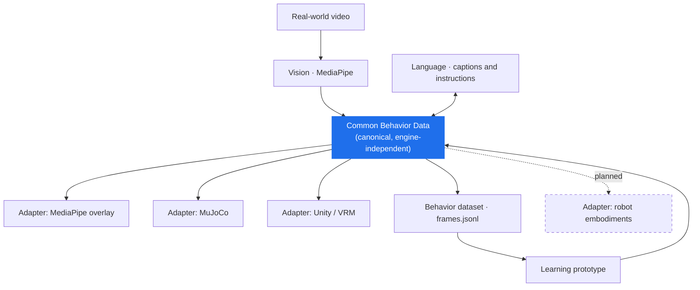

<div align="center">

# Common Behavior Data

**Behavior should be portable.**

An experimental open behavior representation for interoperable robotics,
simulation, AI, and motion applications.

[](docs/limitations.md)
[](LICENSE)
[](#what-works-today)

[日本語 README](README.ja.md) ·
[Concept](docs/concept.md) ·
[Architecture](docs/architecture.md) ·
[Specification](specification/README.md) ·
[Roadmap](docs/roadmap.md) ·
[Limitations](docs/limitations.md)


*One source video → one behavior dataset → three different renderers, same timeline.*

</div>

---

## Why Common Behavior Data?

Human behavior is captured or generated inside a specific tool: a motion
capture format, a game engine, a simulator, a dataset schema, a model's output
head, a particular robot's joint layout. Move to the next tool and you rebuild
the pipeline.

That is expensive in a normal project. It is worse in robotics and Physical AI,
where the *same* behavior — reach, grasp, carry, place — has to survive a
change of representation, of engine, and eventually of body.

**Common Behavior Data (CBD)** is an experiment in putting one reusable layer
in the middle:

```text
Real-world video  →  Common Behavior Data  →  Language-aligned learning
                            ↓                          ↓
                     MuJoCo / Unity  ←  Generated behavior
```

> **From real-world video to reusable behavior data — and from language back to motion.**

## What is CBD?

CBD is a **behavior representation**, not a dataset and not a standard.

It aims to hold, on one common timeline:

pose · hands · face and expressions · gestures · bone rotations · joint angles ·
object detections and tracks · interaction candidates · behavior phase ·
temporal captions · motion metrics · quality and provenance metadata

**Status: experimental.** The schema is evolving and is being driven by real
adapter implementations rather than designed up front. It is not an established
standard, it has no industry adoption, and it is not finished. See
[`specification/`](specification/README.md) for what exists today and what is
explicitly still open.

## What works today

Two end-to-end demos, running in Colab, arranged around the same representation.

| | Demo A — Human Capture | Demo B — Language to Motion |
|---|---|---|
| Direction | Observation → behavior data | Behavior data → learning → generation |
| Input | One video of a person | Demo A output bundles |
| Output | `frames.jsonl` + CSVs + `motion.vrma` + `humanoid.xml`/`motion.npz` | The same file set, generated from a sentence |
| Status | Working | Working, small-scale prototype |
| Notebook | [`examples/human-capture`](examples/human-capture/) | [`examples/language-to-motion`](examples/language-to-motion/) |

The point is not either demo on its own. It is that **they meet in the middle**:
the representation that describes observed motion is the same representation a
model learns from, and the same one it generates back into.

## One behavior layer, multiple outputs



The design rule that makes this worth doing:

```text
Do not build:            Prefer:
  Language → Unity         Language
  Language → MuJoCo           ↓
  Language → Robot         Behavior
                              ↓
                         Embodiment / engine-specific adapter
```

Adding the fifth consumer should mean writing one adapter, not one more
pipeline. That is the whole bet. More in [`docs/architecture.md`](docs/architecture.md).

---

## Demo A — Video → CBD

**One source video becomes reusable behavior data for multiple representations.**


MediaPipe is never wired directly to MuJoCo or to Unity. Vision writes into
CBD; every renderer reads out of it.

- The overlay video is CBD drawn back onto the original pixels
- MuJoCo gets `humanoid.xml` (model) + `motion.npz` (motion), deliberately separate
- Unity gets `motion.vrma`, playable on any VRM 1.0 avatar — **Unity is playback
  and visualisation here, never the inference engine**
- Everything else lands in `04_behavior_dataset/`, which is the master data

[](https://colab.research.google.com/github/Koichi3333/common-behavior-data/blob/main/examples/human-capture/human_behavior_demo_2_0.ipynb)

→ **[Run it / read the details](examples/human-capture/README.md)** ·
[sample output](examples/human-capture/sample_output/)

## Demo B — Language → CBD

**Behavior captured in Demo A becomes training data, and generated behavior
returns through the same adapters.**


*Three behaviors generated from three English instructions, replayed through
the Demo A MuJoCo adapter. Nothing downstream knows they were generated.*

Each line of `frames.jsonl` already pairs a prompt (frame image + caption) with
an answer (bone rotations, hips, finger curls, phase), because they were
written onto one timeline. So no annotation step is needed — a small causal
Transformer with vision and text conditioning trains directly on it, and emits
`frames.jsonl`, `motion.vrma`, `humanoid.xml`, `motion.npz`, `replay_mujoco.py`.

> ⚠️ **This is not a general-purpose VLA.** At the current scale it is a small
> VLA-like learning prototype that demonstrates memorisation, interpolation and
> language-conditioned behavior generation. It does not generalise to unseen
> instructions. That limit is stated here on purpose, not buried at the bottom.

[](https://colab.research.google.com/github/Koichi3333/common-behavior-data/blob/main/examples/language-to-motion/human_behavior_vla_trainer.ipynb)

→ **[Run it / read the details](examples/language-to-motion/README.md)** ·
[sample output](examples/language-to-motion/sample_output/)

---

## Data representation

`timeline/frames.jsonl` is the file that carries the idea. **One line is one
frame, and one frame is a complete tuple:**

```jsonc
{
  "frame": 42,
  "timestamp_sec": 3.5,
  "frame_image": "timeline/frames/000042.jpg",     // vision
  "caption": { "en": "The person reaches for the cup", "source": "gemini_api" },  // language
  "human": {
    "bone_rotations_xyzw": { "left_upper_arm": [x, y, z, w], "...": [] },        // motion
    "hips_position": [x, y, z],
    "finger_curls_rad": { "left": [...], "right": [...] },
    "joint_angles_deg": {}, "face_blendshapes": {}, "gestures": {}
  },
  "objects": [ { "track_id": "obj_005", "label": "cup", "role": "target",
                 "position_source": "estimated_from_hand" } ],                    // objects
  "interactions": [ { "type": "grasp_candidate", "score": 0.8 } ],                // candidates
  "phase": { "action": "Pick And Place", "phase": "Grasp", "hand": "Right" }      // state
}
```

Vision + language + motion + object + phase, aligned. That alignment is what
makes the same file both an observation record and a training sample.

Alongside it, the same data is projected into column-oriented CSVs
(`human/`, `objects/`, `interactions/`, `metrics/`) for analysis and for
adapters that only need one series. Details in
[`specification/README.md`](specification/README.md).

Three conventions worth calling out, because they are about honesty:

- **`interaction_events` are candidates.** Heuristics, not ground truth. The
  column names say so.
- **Derived 3D positions always carry `position_source`** (`detected_2d`,
  `estimated_from_hand`, `last_known_position`, `fixed_depth_proxy`, …). We do
  not fabricate depth silently.
- **Captions are AI-generated descriptions**, recorded with the model that
  produced them.

## Adapter status

| Adapter / connection | Status | Current evidence |
|---|---|---|
| Video → CBD | **Available** | Demo A, [`examples/human-capture`](examples/human-capture/) |
| CBD → MuJoCo humanoid | **Available** | Kinematic replay (`qpos` + `mj_forward`) |
| CBD → Unity / VRM | **Available** | VRMA export, playback in UniVRM SimpleVrma |
| CBD → behavior dataset | **Available** | `frames.jsonl` + CSVs |
| Language → CBD | **Experimental** | Demo B, small learning prototype |
| CBD → SO-101 / MuJoCo | Planned next | Pick & place reference demo |
| CBD ↔ LeRobot | Planned | Integration / contributor target |
| CBD → Isaac | Planned | Integration target |
| CBD → ROS 2 | Planned | Integration target |

Nothing marked *Planned* exists as code in this repository. There are no empty
adapter directories pretending otherwise — see [`docs/roadmap.md`](docs/roadmap.md).

## Try the demos

Both notebooks are built for Colab and need no local setup.

1. Open [`examples/human-capture/human_behavior_demo_2_0.ipynb`](examples/human-capture/human_behavior_demo_2_0.ipynb) in Colab
2. `Runtime → Change runtime type → T4 GPU` (CPU also completes, just slower)
3. Run the cells in order; cell `[2]` asks for a 10–30 s video of one person
   picking something up
4. *(optional)* Add a Colab secret named `GEMINI_API_KEY` for temporal captions
5. Download `demo2_output_bundle.zip`
6. Open [`examples/language-to-motion/human_behavior_vla_trainer.ipynb`](examples/language-to-motion/human_behavior_vla_trainer.ipynb),
   drop your bundles in, train, and generate behavior from your own sentences

No API key is required for the core pipeline. Credentials are read only from
Colab Secrets or the environment and are never written into the notebooks.

Prefer to look before running? Both demos ship their real output:
[`human-capture/sample_output/`](examples/human-capture/sample_output/) and
[`language-to-motion/sample_output/`](examples/language-to-motion/sample_output/).

## Why open?

Large organisations will win on dataset scale, model size, dedicated hardware,
and vertically integrated robot stacks. This project is not competing there.

The hypothesis it *is* testing is that there is durable value in the opposite
properties: neutrality, interoperability, open specifications, reusable
behavior semantics, and adapter-based integration — a layer that belongs to
nobody in particular, and is therefore usable by everybody.

```text
Core maintains the behavior representation
        ↓
Contributors add adapters and tools
        ↓
More systems become compatible
        ↓
More users → more contributors and partners
```

That is the design goal, stated as a goal. It is not traction, and this
repository will not pretend otherwise. More in [`docs/ecosystem.md`](docs/ecosystem.md).

## Roadmap

The next real question is not more human capture. It is whether the abstraction
**survives a change of embodiment**.

**Next: SO-101 pick & place.**

```text
Human video → CBD → behavior intent / end-effector representation
                 → SO-101 adapter → MuJoCo SO-101 → task success
```

The goal is explicitly *not* copying human joint angles onto a robot arm. It is
testing whether behavior intent — reach, grasp, lift, carry, place, release —
can be re-embodied. Full plan in [`docs/roadmap.md`](docs/roadmap.md).

## Limitations

Visible on purpose. The short version:

- Single-person capture; depth is monocular estimation
- Interaction detection is heuristic **candidates**, not ground truth
- MuJoCo playback is **kinematic replay**, not physically correct contact
- The learning prototype memorises and interpolates; it does not generalise
- No sim-to-real, no robot task success, no grasp correctness claim
- Finger angles are approximations from hand landmark curl
- The schema is unstable and will change

Full list with reasoning: [`docs/limitations.md`](docs/limitations.md).

## Contributing

This is an early, independent open-source experiment, and the edges are exactly
where contribution helps most: robot and simulator adapters, ROS 2, Isaac,
Blender / Unreal exporters, IK and retargeting, visualisation, evaluation
tools, VLM integrations, reference applications.

Start with [`CONTRIBUTING.md`](CONTRIBUTING.md). Open an issue or a discussion
before large design changes — the schema is still moving, and it should move
because of a real integration rather than in the abstract.

## Using CBD?

**Tell us what you are building.** Have a robot, simulator, model, or
application you would like to connect? Want an adapter that does not exist yet?
Open a [Discussion](https://github.com/Koichi3333/common-behavior-data/discussions) or an [Issue](https://github.com/Koichi3333/common-behavior-data/issues).

Feedback that a schema decision is wrong is more useful here than a star.

## Why I'm building this

Robotics, simulation, motion, and AI ecosystems are advancing quickly, but
behavior data is still usually tied to a particular tool or embodiment. I am an
independent builder exploring whether a small, open, reusable behavior layer can
make experiments easier to connect and extend — starting with two demos that
already work end to end, and finding out where the idea breaks.

## License and third-party materials

The repository's original source code and documentation are licensed under
**Apache-2.0** ([`LICENSE`](LICENSE)) unless otherwise noted.

Datasets, model weights, demo media, source videos, VRM assets, and third-party
materials may carry separate terms — including the sample outputs in
`examples/*/sample_output/`. See
[`THIRD_PARTY_NOTICES.md`](THIRD_PARTY_NOTICES.md) before redistributing
anything from this repository.
