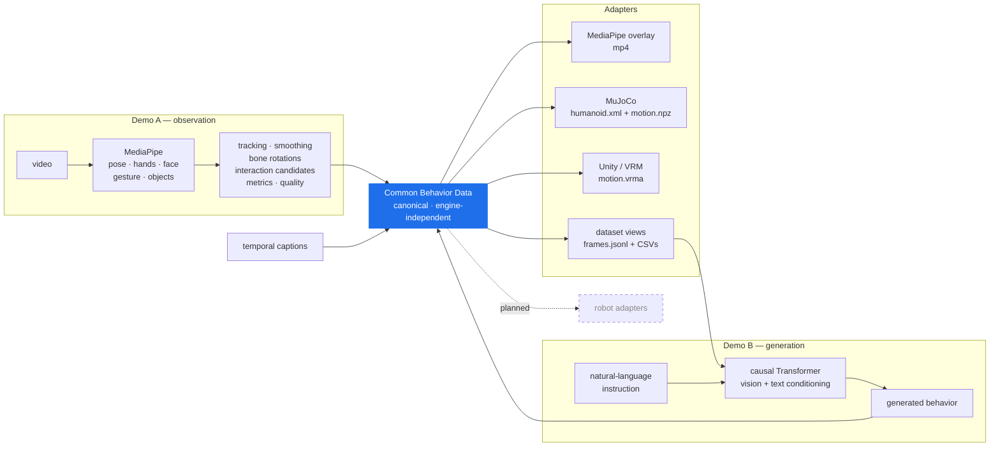

# Architecture

[← back to README](../README.md) · [Concept](concept.md) · [Specification](../specification/README.md)

## The whole picture

```text
                            Language
                               ↕
                        Behavior Layer
                               ↕
Real video → Vision → Common Behavior Data
                               ↕
                      Motion Representation
                               ↓
              ┌────────────────┼────────────────┐
              ↓                ↓                ↓
           Avatar          Simulation        Robotics
          VRM / Unity        MuJoCo          Adapters
                                            (planned)
```

Language sits *beside* the behavior layer, not downstream of it. A caption
describes a span of behavior; an instruction requests one. Both bind to the same
timeline, which is what lets one file be an observation record and a training
sample at once.

## Data flow, as implemented



Note the loop. `OUT --> CBD` is not decoration: generated behavior is written in
the same schema and replayed by the same adapter code that replays observed
behavior. There is no separate "generated motion format".

## Layers

| Layer | What lives there | Changes when |
|---|---|---|
| **Raw observation** | MediaPipe landmarks exactly as produced, detection scores, bounding boxes | never rewritten — kept for provenance |
| **Canonical behavior** | bone rotations, hips position, finger curls, object tracks, phase, captions, interaction candidates | the schema evolves |
| **Adapter output** | `qpos` trajectories, VRMA bone tracks, overlay video, object trajectory JSON | an engine's conventions change |

Derived data never overwrites raw data. If a consumer disagrees with how we
computed a bone rotation, the landmarks it came from are still in the dataset.

## Coordinate systems

One canonical frame, converted at the adapter boundary — never before it.

| Space | Convention | Where |
|---|---|---|
| MediaPipe | x right, y down, z away from camera | raw observation only |
| **Canonical** | **Y-up, right-handed, person faces +Z** | **the behavior layer** |
| MuJoCo | Z-up, person faces −Y | MuJoCo adapter |
| glTF / VRM | Y-up (glTF convention) | VRM adapter |

Bone rotations are quaternions relative to a **T-pose rest**, stored as
`[x, y, z, w]`. Because the MuJoCo humanoid is authored as a zero-rotation
T-pose skeleton, each ball joint's `qpos` is the canonical rotation after a pure
coordinate transform — no retargeting, no IK, no hidden fitting step. That is
deliberate: a transform is auditable, a fitting step is not.

## Two views of the same data

```text
04_behavior_dataset/
├── timeline/frames.jsonl   ← row-oriented: one line = one complete frame
└── human/ objects/ ...     ← column-oriented: one file per series
```

Both are projections of the same master data and must agree.

- **Row-oriented** (`frames.jsonl`) is what a machine-learning DataLoader reads.
  Vision, language, motion, phase, objects and interaction candidates are on one
  line, so a sample is self-contained.
- **Column-oriented** (CSVs) is what analysis and single-purpose adapters read.
  pandas, plotting, "give me only the wrist trajectory".

The one exception is the 478-point face mesh, which is referenced rather than
inlined in `frames.jsonl`, purely for size.

## Model and motion are separate files

```text
humanoid.xml  ↔  motion.npz          (MuJoCo)
avatar.vrm    ↔  motion.vrma         (Unity / VRM)
```

This is the same principle one level down. A body and a behavior are different
things, and pairing them should be a runtime decision. It is also what allows a
VRMA generated from one person's video to play on any VRM 1.0 avatar.

## Where the engines actually sit

A recurring misreading is worth pre-empting:

- **Unity does no inference.** It loads a VRM avatar and a VRMA animation and
  presses play. All motion computation happened upstream in the behavior layer.
- **MuJoCo does no physics here.** Demo A and Demo B both use *kinematic
  replay*: assign `qpos`, call `mj_forward`, render. Contacts and forces are not
  simulated, so nothing in this repository is evidence about physical
  correctness of grasping. Whether contact and force belong in the
  representation itself is a separate, open question — see
  [Roadmap](roadmap.md#also-open-what-cbd-carries).

Both are consumers. Replacing either would not touch the behavior layer.

## What the adapter interface has to become

Today, "adapter" means a section of a notebook that reads canonical data and
writes engine-specific files. That is honest for two demos and will not scale.

The open design question — and a good place to contribute — is what the adapter
contract should be so that a robot adapter, a Blender exporter and an Isaac
bridge can be written by different people without coordinating:

- what a consumer is guaranteed to find in CBD
- how it declares which parts it uses
- how it reports what it could not represent
- how behavior intent (reach / grasp / place) maps onto a body that has none of
  the human's joints

The last one is the re-embodiment question in the [roadmap](roadmap.md), and it
is the part most likely to reshape the schema.

## Where this lives in the repository

The layers above map onto four working directories, each with its own README:

```text
generator/   → writes CBD          (video → CBD, language → CBD)
adapter/     → reads CBD           (MuJoCo, Unity / VRM, dataset views, planned robots)
experiment/  → asks questions of CBD (learning prototypes, re-embodiment, evaluation)
tool/        → helps at any stage    (validation, inspection, visualisation)
```

`examples/` stays as the initial end-to-end demos. All four directories are
placeholders today — the generator, adapter and learning code described on this
page still lives inside those notebooks, and moving it out is the next
structural step.

---

**Next:** [Specification](../specification/README.md) · [Roadmap](roadmap.md) · [Ecosystem](ecosystem.md)
