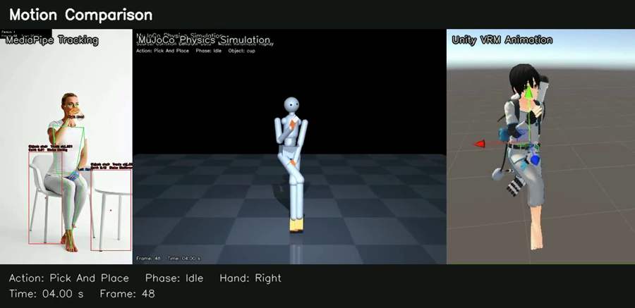

# Concept

[← back to README](../README.md) · [日本語 README](../README.ja.md)

## The problem

Behavior data is usually born inside something.

A motion capture session produces a format tied to its software. A game engine
stores animation the way that engine likes. A simulator wants joint angles in
its own layout. A robot learning dataset encodes actions in the dimensions of
one specific arm. A vision pipeline emits landmarks with no semantics attached.
A generative model outputs whatever its training head predicted.

Each of these is reasonable in isolation. Together they mean that "a person
picks up a cup" exists in six incompatible forms, and connecting any two of
them is a bespoke integration.

The cost shows up as a shape: every new tool multiplies the work instead of
adding to it.

```text
Without a shared layer          With a shared layer

vision ──┬──▶ simulator         vision ──┐
         ├──▶ avatar                     ▼
         └──▶ robot            ┌──────────────────┐
model  ──┬──▶ simulator        │ behavior layer   │
         ├──▶ avatar           └──────────────────┘
         └──▶ robot                      │
                                ┌────────┼────────┐
N × M integrations              ▼        ▼        ▼
                            simulator  avatar   robot
                                 N + M adapters
```

## The question

> Can behavior become reusable across tools, models, simulators, avatars, and
> robot embodiments, instead of being locked into one pipeline?

Common Behavior Data (CBD) is an attempt to answer that empirically, by
building the layer and then trying to break it with real consumers.



*The current evidence: one behavior dataset, three consumers that share no code,
one timeline. The claim being tested is that the fourth consumer is cheap.*

## What CBD is

An **experimental open behavior representation** for interoperable robotics,
simulation, AI, and motion applications.

Concretely, today, that means:

- a **canonical, engine-independent** description of what a body and the objects
  around it are doing, over a common timeline
- with **language and phase aligned to the same timeline**, so a frame is a
  complete observation rather than a bag of numbers
- with **provenance and quality metadata**, so a consumer can tell measurement
  from estimation
- consumed through **adapters**, so engines and embodiments are peripheral, not
  central

## What CBD is not

- **Not a standard.** No specification body, no version 1.0, no adoption. The
  schema changes when an adapter proves it should.
- **Not a dataset.** Datasets are one thing you can express in CBD. The name is
  deliberately *Common Behavior Data*, not *Common Behavior Dataset* — the
  representation is broader than any corpus captured with it.
- **Not a motion capture product.** Demo A uses off-the-shelf vision models.
  The interesting part is the layer they write into, not the capture quality.
- **Not a general-purpose VLA.** Demo B is a small learning prototype. See
  [limitations](limitations.md).

## The core design rule

The single most important idea in this repository:

```text
Do not build:            Prefer:
  Language → Unity         Language
  Language → MuJoCo           ↓
  Language → Robot         Behavior
                              ↓
                         Embodiment / engine-specific adapter
```

Every direct connection between a producer and a consumer is a connection that
has to be rebuilt for the next pair. Every connection routed through the
behavior layer is one that the next consumer inherits for free.

This is also why MuJoCo and Unity appear in this project as *adapters* and never
as the canonical model. `motion.npz` is a projection of the behavior data.
`motion.vrma` is a projection of the behavior data. Neither is the source of
truth, and either could be regenerated from scratch.

## Why two demos, in opposite directions

Demo A (video → CBD) alone would just be motion capture with extra files.

Demo B (language → CBD) alone would just be a small motion generation model.

Together they test something more specific: **the same representation that
describes observed behavior can be the training corpus for generating behavior,
and generated behavior can flow back out through the same adapters.**

If that holds, the layer is doing real work. If a separate format had been
needed for the generated side, it would not be a behavior layer — it would be
two pipelines that happen to share a diagram.

## Where this is going

The current demos both operate on a human body. The next question is harder and
more interesting: does the abstraction **survive a change of embodiment**?

A robot arm does not have a spine, shoulders, or five fingers. Copying human
joint angles onto it is meaningless. But *reach, grasp, lift, carry, place,
release* might survive — as behavior intent plus an end-effector representation,
re-embodied by an adapter.

That is the SO-101 pick & place experiment in the [roadmap](roadmap.md), and it
is the point at which this idea either becomes useful or gets falsified.

---

**Next:** [Architecture](architecture.md) · [Specification](../specification/README.md) · [Limitations](limitations.md)
